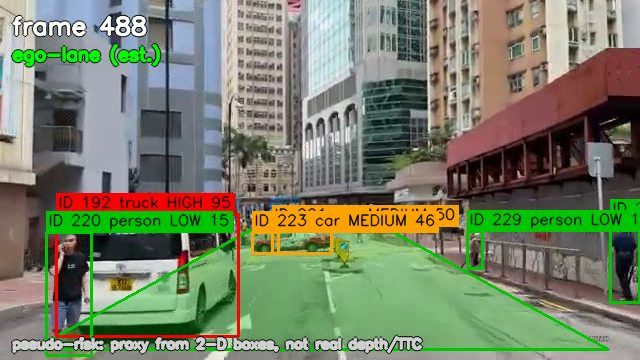

# ADAS Vision Workbench

A Windows computer-vision **ADAS perception workbench**: it ingests a driving
video and produces object detection, multi-object tracking, lane / drivable-area
estimation, a **pseudo-distance risk score** (LOW / MEDIUM / HIGH), event logs,
an annotated output video, a benchmark report, and a live FastAPI dashboard.


> ⚠️ **Honesty note:** distance and time-to-collision (TTC) here are **proxies**
> derived from 2-D bounding-box geometry — **not** real depth-based
> measurements. Real depth-based distance/TTC is planned for the ROS 2 + CARLA
> port (Project B). This tool never claims true physical distance.

---

## What it does

A decoupled per-frame pipeline:

**Video → Detection (YOLO11n) → Tracking (IoU) → Lane / drivable-area (classical CV) → Risk (pseudo-distance) → Overlays + Logs + Dashboard**

- **Detection** — YOLO11n, filtered to 8 ADAS classes (person, bicycle, car, motorcycle, bus, truck, traffic light, stop sign).
- **Tracking** — greedy IoU matching with persistent track IDs (structured for a SORT/Kalman upgrade).
- **Lane** — ROI + Canny + Hough ego-lane estimate, with a graceful drivable-area fallback.
- **Risk** — blends closeness, approach, ego-lane overlap, class weight, and a pseudo-TTC into a 0–100 score → LOW / MEDIUM / HIGH.
- **Outputs** — annotated video, `events.csv` / `frame_metrics.csv` / `scene_summary.json`, a benchmark report, and a live dashboard with human-readable event explanations.

Every module takes plain data in / out with no hidden state, so it ports cleanly to ROS 2 — see [docs/ros2_porting_plan.md](docs/ros2_porting_plan.md).

---

## Quickstart (Windows + PowerShell)

Prerequisites: **Python 3.10, Git, FFmpeg** (the Phase A0 `winget` commands are in [CLAUDE.md](CLAUDE.md)).

```powershell
git clone https://github.com/AmanouNasri1/adas-vision.git
cd adas-vision
py -3.10 -m venv .venv
.\.venv\Scripts\Activate.ps1
python -m pip install --upgrade pip
python -m pip install -r requirements.txt
```

> **CPU-only machine?** `requirements.txt` pins the CUDA build. Swap the two `torch`
> lines for the CPU build from the [PyTorch selector](https://pytorch.org/get-started/locally/), then re-install.

### Run the demo

```powershell
python apps\run_video_demo.py --input data\sample_videos\test_drive.mp4
# add --benchmark to also write reports/benchmark_report.md
# add --device cpu to force CPU
```

### Launch the dashboard

```powershell
python apps\run_dashboard.py    # then open http://127.0.0.1:8000
```

---

## Architecture

```
Driving Video → Video Loader → Object Detection → Object Tracking
  → Lane / Drivable-Area → Risk Estimation → Outputs
       ├── annotated video
       ├── event logs (events.csv, frame_metrics.csv, scene_summary.json)
       ├── dashboard
       └── benchmark report
```

Full module responsibilities + per-frame data contracts: [docs/architecture.md](docs/architecture.md).

---

## Results

Sample 30 s urban clip (640×360), NVIDIA RTX 3050 Laptop GPU:

| Metric | Value |
| --- | --- |
| Device | CUDA (RTX 3050) |
| Throughput (end-to-end) | ~31 FPS |
| Processed frames | 900 |
| Total detections | 4,865 |
| Unique tracks | 191 |
| Risk track-frames (LOW / MED / HIGH) | 2,453 / 1,735 / 22 |
| High-risk (`brake_warning`) events | 22 |

Generated by `--benchmark` → [reports/benchmark_report.md](reports/benchmark_report.md).



---

## Limitations (stated honestly)

- **No real depth.** Distance / TTC are 2-D bounding-box proxies, not metres / seconds.
- **Classical-CV lanes.** Fragile on faded markings, glare, low light, and sharp curves.
- **Nano detector + greedy IoU tracker.** Small / distant / occluded objects can be missed; IDs can switch under heavy occlusion.

Full write-up: [docs/limitations.md](docs/limitations.md).

---

## Roadmap

| Phase | Status |
| --- | --- |
| A0–A2 — tools, env, dependencies | ✅ |
| A3 — repo structure + docs | ✅ |
| A4 — video I/O pipeline | ✅ |
| A5 — object detection (YOLO11n) | ✅ |
| A6 — object tracking (IoU) | ✅ |
| A7 — lane / drivable-area | ✅ |
| A8 — risk (pseudo-distance) | ✅ |
| A9 — event logging | ✅ |
| A10 — FastAPI dashboard | ✅ |
| A11 — benchmark mode | ✅ |
| A13 — scene explainer (template) | ✅ |
| A12 — ONNX export & comparison | ⬜ optional |

**Next (Project B):** ROS 2 + CARLA port with real depth-based distance / TTC.

---

## License

_TBD._
